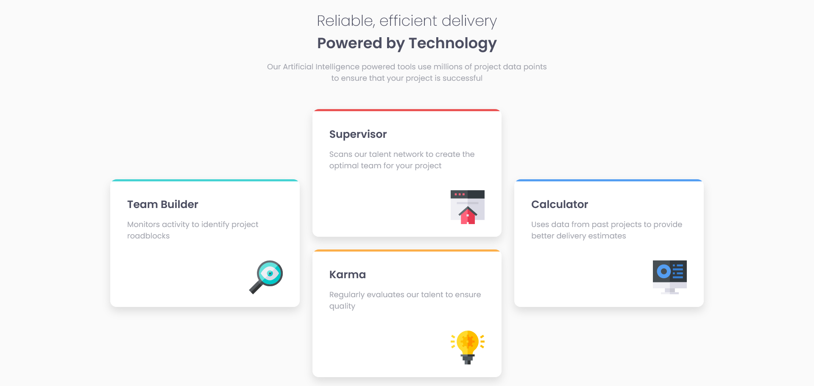

# Frontend Mentor - Four card feature section solution

This is a solution to the [Four card feature section challenge on Frontend Mentor](https://www.frontendmentor.io/challenges/four-card-feature-section-weK1eFYK). Frontend Mentor challenges help you improve your coding skills by building realistic projects. 

### Screenshot

### Links

- Solution URL: https://github.com/fabrizio411/fend-m-010
- Live Site URL: https://fabrizio411.github.io/fend-m-010/

### Built with

- Semantic HTML5 markup
- CSS custom properties
- Flexbox
- Grid